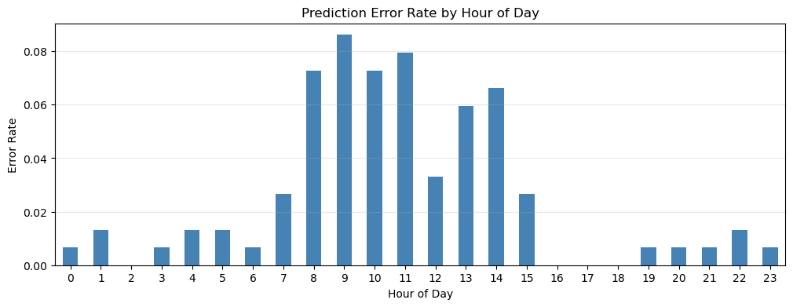

# Predicting curtailment events

Project completed for Erdos insititute deep learning bootcamp (summer-2026)

### Team members

1.  [Ranadeep Roy](https://github.com/ranadeep83)
2.  [Yuanfan Wang](https://github.com/yuw136)

## Project overview

In this project, we build and evaluates machine learning models that predicts electricity curtailment in Germany.

## Motivation and problem statement

Germany's electricity system is increasingly shaped by high shares of wind and solar generation. As renewable output grows, the system more frequently faces times when available clean electricity cannot be fully consumed because of grid congestion, regional oversupply, etc. In this context, **curtailment** refers to the reduction of power production when there is too much electricity in the grid. Curtailments are necessary to avoid blackouts or regional interruptios of power supply. At the same time, curtailing infeed from renewables is highly inefficient, leading to both montary and energy loss. For example, Germany spent 425 million euros as compensation costs for the curtailment of renewable energy [source](https://www.euronews.com/2026/03/27/european-country-vows-to-give-homeowners-free-electricity-instead-of-switching-off-wind-tu)

Being able to anticipate curtailment hours is therefore useful for grid planning, market analysis, and operational decision-making. This project studies whether curtailment events can be predicted/classified from historical energy production, price, and regional weather data.

## Stakeholders

The main stakeholders are German renewable energy producers, electricity market participants, grid planners, regulators, policymakers, etc.

## Dataset

1. Main datasets

- Electricity generation, consumption, day-ahead prices: `SMARD.de`. SMARD provides hourly data for actual electricity generation categorized by various sources. In addition to this, the actual consumption data, residual load and the day-ahead prices data is also provided.

- Weather data: Open meteo, https://open-meteo.com/en/docs/historical-weather-api and forecast weather data, https://previous-runs-api.open-meteo.com/v1/forecast. Open meteor provides hourly weather data such as wind speed, solar radiation, cloud cover which are direct factors for wind and solar electricity production in various locations in Germany.

2. Our target is negative price event at time `t_0`, with `y = 1` meaning curtailment happens at hour `t_0`. Our features include price, electricity generation in different categories, actual consumption, wind speed and solar radiation measurements for `t < t_0 - 23`. We also include same category of weather data forecasted 24 hour ahead from `t_0 - 23` to `t_0`.

## Modeling approach

Dataset is split in to roughly 60%/20%/20% fashion as train/validation/test sets. We evaluate model performance by calclulating pr-auc score and best f1 score among thresholds on predictions in validation set. Models considered include XGBoost with lag features, and time series models such as lstm, tcn, and tft.

## Results

## Conclusion and future directions

## Folder organization
