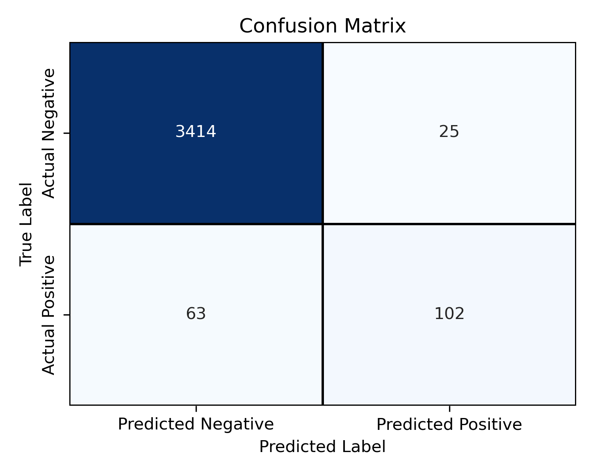
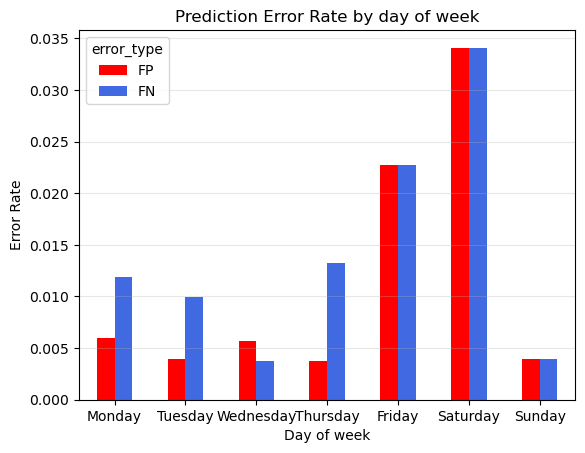
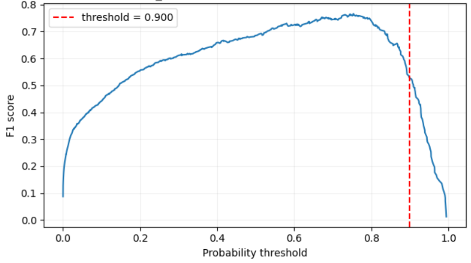
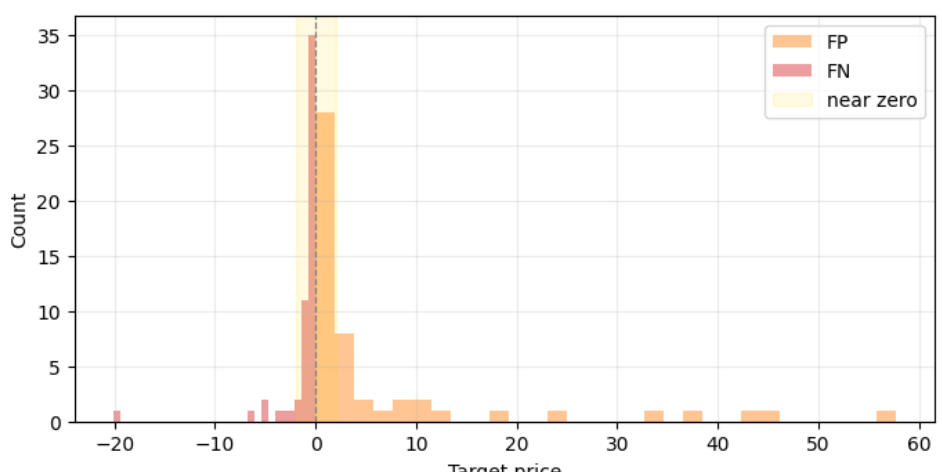

# Predicting curtailment events

Project completed for Erdos insititute deep learning bootcamp (summer-2026)

### Team members

1.  [Ranadeep Roy](https://github.com/ranadeep83)
2.  [Yuanfan Wang](https://github.com/yuw136)

## Project overview

In this project, we build and evaluates machine learning models that predict electricity curtailment in Germany.

## Motivation and problem statement

Germany's electricity system is increasingly shaped by high shares of wind and solar generation. As renewable output grows, the system more frequently faces times when available clean electricity cannot be fully consumed because of grid congestion, regional oversupply, etc. In this context, **curtailment** refers to the reduction of power production when there is too much electricity in the grid. Curtailments are necessary to avoid blackouts or regional interruptios of power supply. At the same time, curtailing infeed from renewables is highly inefficient, leading to both montary and energy loss. For example, Germany spent 425 million euros as compensation costs for the curtailment of renewable energy [source](https://www.euronews.com/2026/03/27/european-country-vows-to-give-homeowners-free-electricity-instead-of-switching-off-wind-tu)

Being able to anticipate curtailment hours is therefore useful for grid planning, market analysis, and operational decision-making. This project studies whether curtailment events can be predicted/classified from historical energy production, price, and regional weather data.

## Stakeholders

The main stakeholders are German renewable energy producers, electricity market participants, grid planners, regulators, policymakers, etc.

## Dataset

1. Main datasets

- Electricity generation, consumption, day-ahead prices: `SMARD.de`. SMARD provides hourly data for actual electricity generation categorized by various sources. In addition to this, the actual consumption data, residual load and the day-ahead prices data are also provided.

- Weather data: Open meteo, https://open-meteo.com/en/docs/historical-weather-api and forecast weather data, https://previous-runs-api.open-meteo.com/v1/forecast. Open meteo provides hourly weather data such as wind speed, solar radiation, cloud cover which are direct factors for wind and solar electricity production in various locations in Germany. One can find raw and processed data from [raw_data](https://drive.google.com/drive/folders/1Hdh1lPg-RQljx7lzWZLcbSLa1OY9ehX4) and [processed_data](https://drive.google.com/drive/folders/1UTxdQRsDAkfqet1Ttm704oguYIleo3JO), or run [download_open+meteo_weather.ipynb](EDA/download_open_meteo_weather.ipynb) to download the data.

2. Our target is negative price event at time `t_0`, with `y = 1` meaning curtailment happens at hour `t_0`. Our features include price, electricity generation in different categories, actual consumption, wind speed and solar radiation measurements for `t < t_0 - 23`. We also include the same category of weather data forecasted 24 hour ahead from `t_0 - 23` to `t_0` (for TCN and LSTM) and just the forecasted data at `t_0` for TFT.

## Modeling approach

Dataset is split in to roughly 60%/20%/20% fashion as train/validation/test sets. We evaluate model performance by calclulating pr-auc score and best f1 score among thresholds on predictions in validation set. The F1 score on test set is evaluated with best threshold obtained on validation set.

## Results

1. Hyperparameter-tuned TFT models produced the best PR-AUC and F1 score on the validation set.
2. On the test-set, we obtained a PR-AUC score of 0.70 and an F1 score of 0.69 . The corresponding confusion matrix is shown below.

3.Inspecting the errors on the validation set (hyperparameter-tuned TFT model), we note that most errors occured during the afternoons and on Fridays and Saturdays. This suggests that it might be helpful to train a model by specifically incorporating a feature denoting whether the prediction day is Friday/Saturday.

 

## Conclusion and future directions

1. prediction error rate by hour of the day is expectable: curtailment usually happens at noon when solar radiation is the strongest, and the models in general can't set precise boundary between strong and weak solar radiation that leads to a curtailment. Thus there are more wrong prediction near noon but less at the peak of solar radiation.

2. Due to the small size of data, the train, valid, test set we use are heterogeneous: For example, while training set has data for ~1 year and 3 months, validation set only contains fall and part of winter, and test set has only part of winter + Spring. This might explain degradation of perfomance from valid set to test set for some models, especially for models with emphasis on short-term/fixed term memory like TCN.

More data will enable more robust models and analysis of curtailment in other regions.

3. Inspecting the errors on validation set of the TCN model, we see that there are many wrong predictions at high absolute price values, e.g. predicting negative price when actual price is pretty high.
   
   These "high value error", we believe, will be more harmful in reality. We designed a loss function to penalize this behavior (which also can be used to weight FN and FP errors differently):

$$
\mathcal{L}(z,y,p)=(1+\lambda_{-}\left(\frac{\max(\tau_{-}-p,0)}{s_{-}}\right)^{\beta_{-}}(p))y\log(\sigma(p))+(1+\lambda_{+}\left(\frac{\max(p-\tau_{+},0)}{s_{+}}\right)^{\beta_{+}}(p))(1-y)\log(1-\sigma(p)),
$$

With this loss "high value errors" can be reduced by 25%, while F1 and PR-AUC decreases due to introduction of more low value errors. See [error_analysis.ipynb](Experimental_modeling/error_analysis.ipynb) and [Fix_price_severity_experiments.ipynb](Experimental_modeling/Fix_price_severity_experiments.ipynb).

## Folder organization
